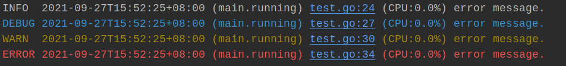

# console

异步、快速、分级的日志记录，超过阀值自动压缩。

<br>

## Quick Start

```go
// 激活并启用功能
defer console.New(&console.Options{
    Info: true, Debug: true, Warning: true, Error: true, Print: true,
    LogFileSizeMB: 1024,
    MaxBackups:    10,
    Filename:      "log/execution.log",
}).Wait()

txt := "error message."

// INFO
console.INFO(txt)

// DEBUG
console.DEBUG(txt)

// WARN
warn := console.WARN(txt)
fmt.Printf("WARN: %s\n", warn)

// ERROR
err := console.ERROR(errors.New(txt))
fmt.Printf("ERROR: %s\n", err)
```

## Installing

```
go get github.com/matsuwin/console
```

<br>


